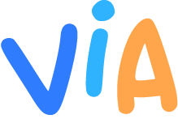

<h3 style="text-align:center; color:#30b3ff; font-weight:bold;" align="center">A neighbours social application</h3>

 
 
<h2 style="color:#ffa64d; font-weight:bold">--- What is Via ? ---</h2>

Via is a social application.  
It connects neighbours so they can discuss, share, offer skills, things they want to give away or organize events where they can meet and get to know each other.

 
<h2 style="color:#ffa64d; font-weight:bold">--- The needs ---</h2>

Web and mobile social media applications generally offer a global service which allow people to connect on a large geographical level. Users can then organize, offer and meet on a city or even larger scale.

The benefit is obviously that it offers a larger choice of activites on a larger area, giving users a greater freedom.
But this freedom comes with a loss in social bond. Moreover, each day sees new local initiatives in plenty of different areas such as food, social services, climate concern, etc.

 
<h2 style="color:#ffa64d; font-weight:bold">--- The objectives ---</h2>

The main objective for the application is thus to get back on a local scale and give people the opportunity to improve their neighbourhood on their own by making it more alive, more social, more united.
The final goal being for the people to connect, to share and help each other by focusing on a small and local area, strenghtening solidarity, making the neighbourhood a better place to live in.

 
<h2 style="color:#ffa64d; font-weight:bold">--- Table of contents ---</h2>

- [1. Functionalities](#functionalities)
- [2. Technologies](#technologies)
- [3. Project Members](#members)

 
<a id="functionalities"><h2 style="color:#ffa64d; font-weight:bold">--- Functionalities ---</h2></a>

- [1. User Profile](#profile)
- [2. Activities](#activities)
- [3. Bookmarks](#bookmarks)
- [4. Filters](#filters)
- [5. Map](#map)
- [6. Comments](#comments)

#

<a id="profile" style="color:#30b3ff"><h4>1. User Profile</h4></a>

User profile is where one can access its own informations.
It gathers the nickname, the profile image, the first name, the last name, a phone number, the adress of the user, a description and the list of activities he/she created.

One can easily update its profile, modifying whatever info he/she wants to show other users.
Once a field is filled by the user, the information becomes public.

<a id="activities" style="color:#30b3ff"><h4>2. Activities</h4></a>

Activities are at the heart of the application. They can be characterized by three major types:
- Request
- Offer
- Event

Every activity should indicates several informations:
- The user who created the activity
- A date
- A title
- A description
- One or more types
- A location
- A list of people who decided to take part in the acitivity

A user is able to:
- Create an activity
- Update its own activities
- Delete its own activities
- Bookmark activities
- Indicate his/her taking part in activities
- Leave comments on activities

<a id="bookmarks" style="color:#30b3ff"><h4>3. Bookmarks</h4></a>

If the user find interest in one activity, he/she can add it the his/her bookmarks. The activity will then appear in his/her bookmarks list and will then be easily retrievable.
Bookmarked activity can be unbookmarked the same way.

<a id="filters" style="color:#30b3ff"><h4>4. Filters</h4></a>

As many activities are created, the map can be filled with markers, making it difficult to read.
To clear it up a bit, the application lets the user filter the activity list by activity type.
She/he then won't see any activity markers but the one she/he chose (eg. 'Guitar course').

<a id="map" style="color:#30b3ff"><h4>5. Map</h4></a>

The interactive map is the main interface of the application.
User can navigate through it and zoom on an interested location.
One user can click on markers to open a small window showing activity informations, user profile and comments.

<a id="comments" style="color:#30b3ff"><h4>6. Comments</h4></a>

Once a user has opened an activity window, she/he can post comments on it, letting her/him ask about the activity or offer some more information.

 
<a id="technologies"><h2 style="color:#ffa64d; font-weight:bold">--- Technologies ---</h2></a>
 

 
<a id="members"><h2 style="color:#ffa64d; font-weight:bold">--- Project members ---</h2></a>

<h4 style="color:#30b3ff; font-weight:bold">Louis Leca</h4><h4 style="color:#307cff"> - Lead dev Front<h4>

<h4 style="color:#30b3ff; font-weight:bold">Mateo Le Fur</h4><h4 style="color:#307cff"> - Lead dev Back, Git master<h4>

<h4 style="color:#30b3ff; font-weight:bold">Benjamin Boy</h4><h4 style="color:#307cff"> - Product owner, scrum master, dev back<h4>

